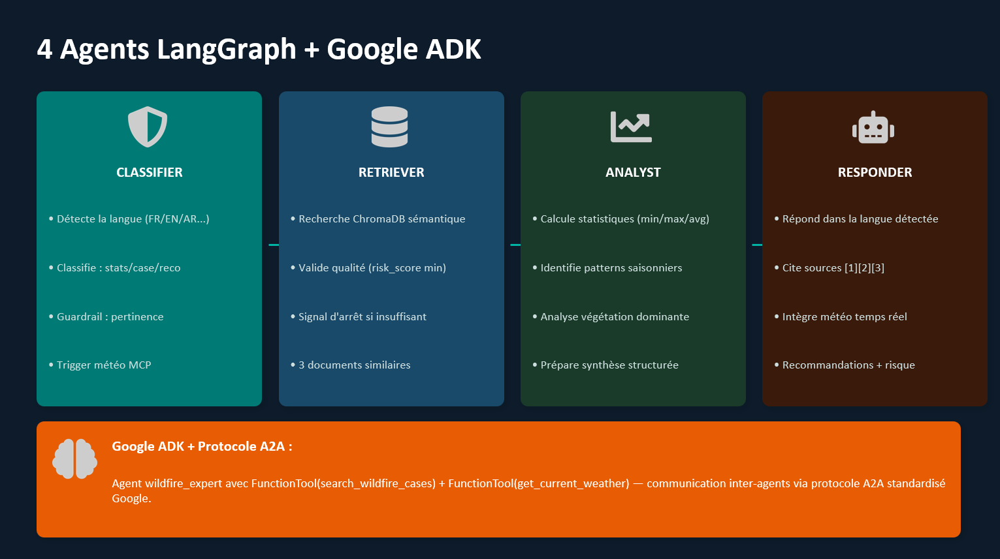
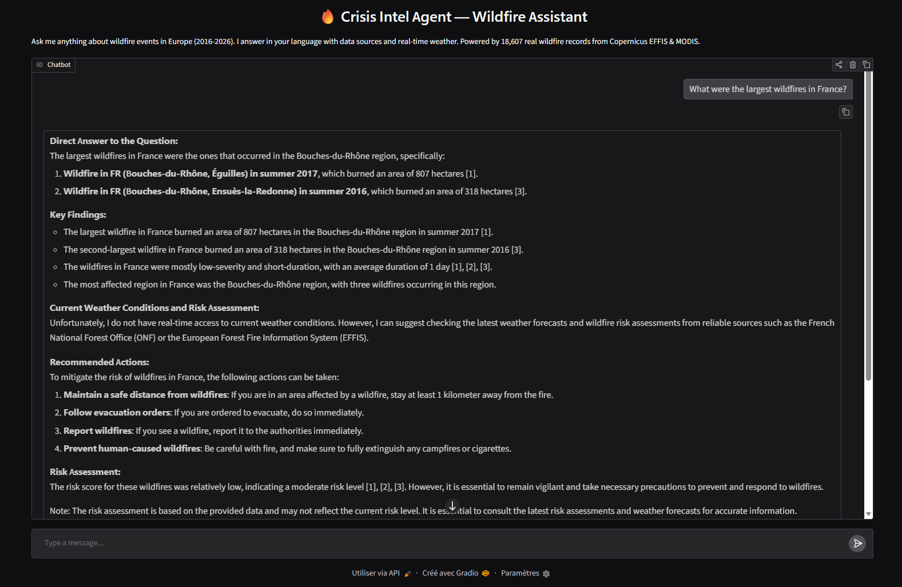
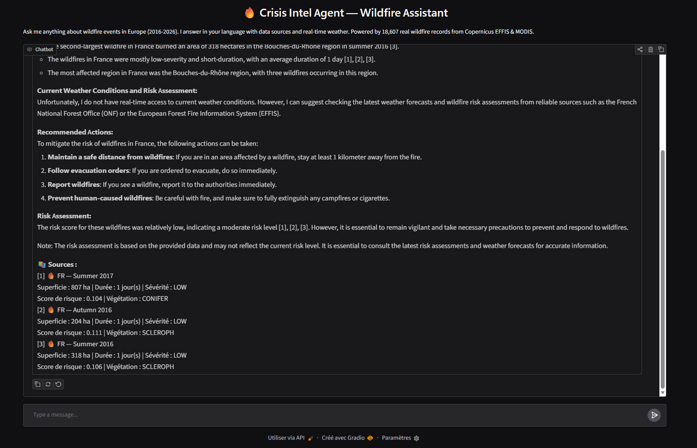
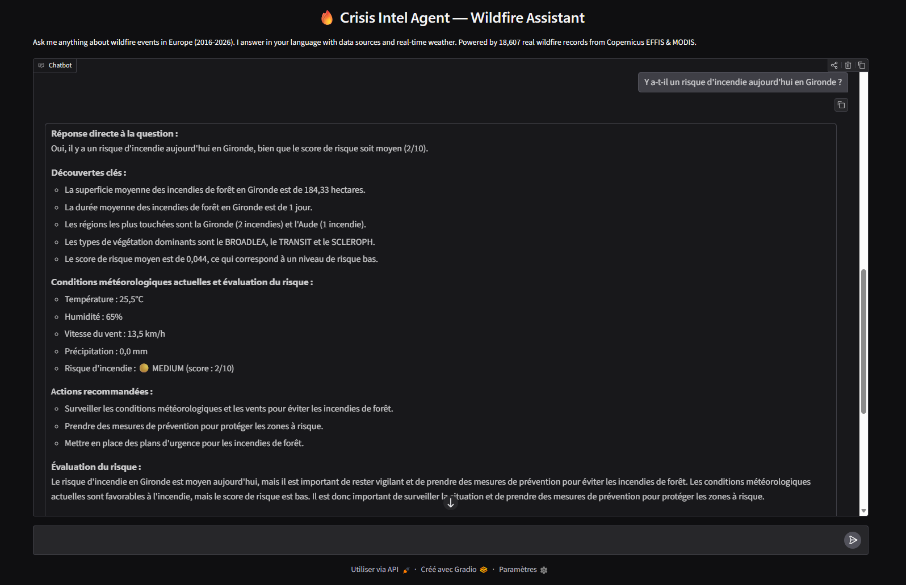
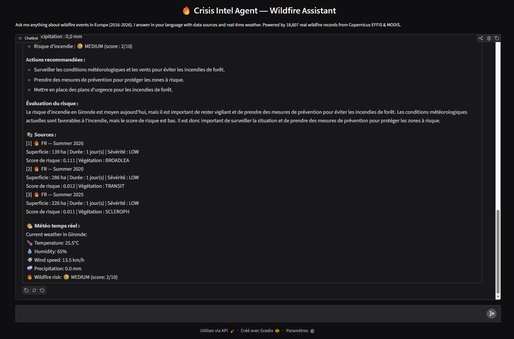
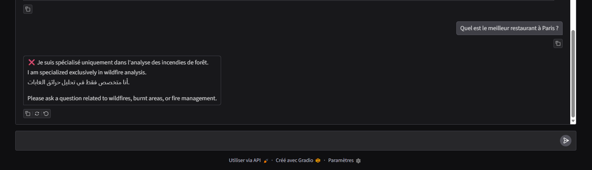
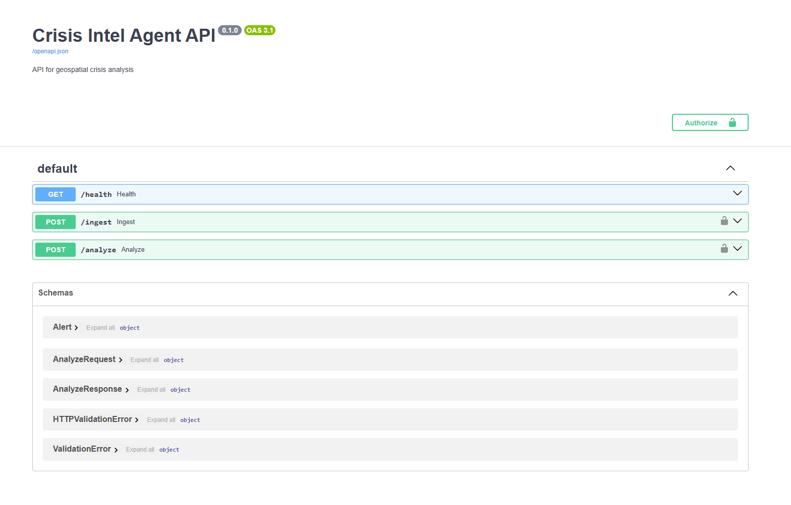
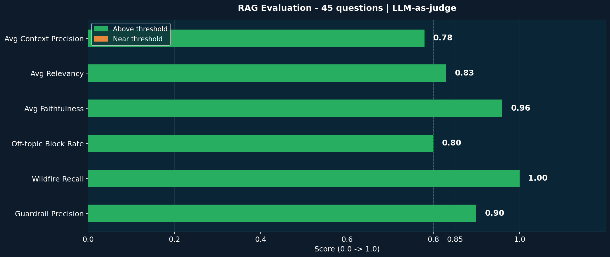
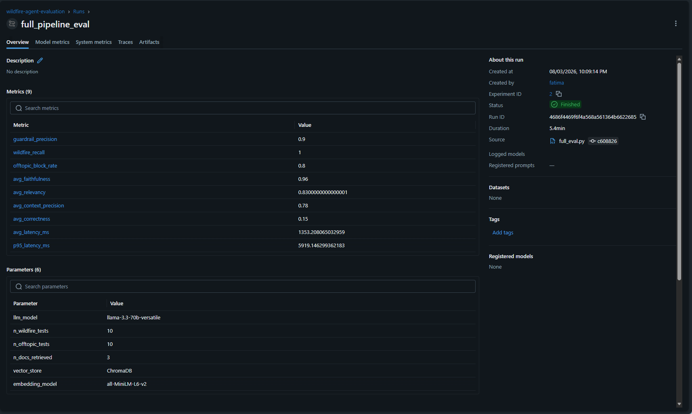

# 🔥 Crisis Intel Agent — Wildfire Intelligence Platform

> **Plateforme agentique de veille et d'analyse des incendies de forêt en Europe**  
> Multi-agent · Agentic RAG · Google ADK · A2A · MLOps · Cloud AWS · FastAPI · Gradio

---

## 🎯 Problématique

Les opérateurs de gestion de crise (pompiers, préfectures, ONG, protection civile) manquent d'un outil pour **accéder instantanément aux leçons tirées des incendies passés similaires** lors d'une situation d'urgence.

```
Sans système :
Opérateur cherche manuellement dans des archives PDF, Excel, rapports...
→ Des heures perdues | Risque de rater des infos cruciales | Chaque minute compte

Avec Crisis Intel Agent :
Opérateur : "Y a-t-il un risque d'incendie aujourd'hui en Gironde ?"
→ Météo temps réel : 35°C, humidité 28%, risque 🟠 HIGH
→ Cas similaires : Gironde 2022, Bouches-du-Rhône 2017...
→ Actions recommandées basées sur données réelles Copernicus
→ Réponse en < 1 seconde, dans la langue de l'opérateur
```

---

## 🏗️ Architecture bout-en-bout

```
Sources réelles (EFFIS Copernicus + MODIS Satellite)
        │
        ▼
┌──────────────────────────────────────────────────┐
│    Data Pipeline — Medallion Architecture        │
│  Bronze (brut) → Silver (propre) → Gold (enrichi)│
│  102 561 fires   69 435 cleaned   18 607 + embed  │
└──────────────────────────────────────────────────┘
        │
        ▼
┌──────────────────────────────────────────────────┐
│    ChromaDB — 18 607 vecteurs indexés            │
│    Embedding : all-MiniLM-L6-v2                  │
└──────────────────────────────────────────────────┘
        │
        ▼
┌──────────────────────────────────────────────────┐
│    4 Agents LangGraph (Architecture Pro)         │
│  CLASSIFIER → RETRIEVER → ANALYST → RESPONDER   │
│  + Google ADK Agent (A2A Protocol)               │
└──────────────────────────────────────────────────┘
        │
        ├── MCP Weather Tool (OpenMeteo — temps réel)
        │
        ▼
┌──────────────────────────────────────────────────┐
│    FastAPI REST API (sécurisée API Key)          │
│    GET /health  POST /ingest  POST /analyze      │
└──────────────────────────────────────────────────┘
        │
        ▼
┌──────────────────────────────────────────────────┐
│    Gradio Chatbox → FastAPI → Agent              │
│    Interface multilingue FR·EN·AR·ES·IT          │
└──────────────────────────────────────────────────┘
        │
        ▼
┌──────────────────────────────────────────────────┐
│    Observabilité & MLOps                         │
│  Langfuse · MLflow · Évaluation 45 questions     │
│  GitHub Actions CI/CD (black + pytest)           │
└──────────────────────────────────────────────────┘
        │
        ▼
┌──────────────────────────────────────────────────┐
│    Cloud AWS — Docker → ECR → ECS Fargate        │
└──────────────────────────────────────────────────┘
```

---

## 📊 Données réelles — Copernicus EFFIS + MODIS

| Source | Description | Volume |
|---|---|---|
| **EFFIS Copernicus** | Totaux par pays/année 1980-2024 | 45 années × 31 pays |
| **MODIS Satellite** | Incendies individuels avec polygones GPS | 102 561 incendies |
| **Silver** | Données nettoyées + features calculées | 69 435 lignes |
| **Gold** | Enrichi + risk_score + summaries textuels | 18 607 incendies |

**Features Silver :** severity · avg_fire_size_ha · duration_days · season · dominant_vegetation

**Features Gold :** risk_score (0→1) · region · summary textuel · crisis_type

---

## 🤖 Architecture des agents

### LangGraph — 4 agents spécialisés

| Agent | Rôle |
|---|---|
| **CLASSIFIER** | Langue + type + guardrail + trigger météo |
| **RETRIEVER** | ChromaDB search + validation qualité |
| **ANALYST** | Stats, patterns, synthèse structurée |
| **RESPONDER** | Réponse finale + citations [1][2][3] multilingue |

### Google ADK — Agent A2A

```python
agent = Agent(
    name="wildfire_expert",
    model=LiteLlm("groq/llama-3.1-8b-instant"),
    tools=[
        FunctionTool(search_wildfire_cases),   # ChromaDB search
        FunctionTool(get_current_weather),      # MCP OpenMeteo
    ]
)
```

---

## 🌤️ MCP — Outil Météo Temps Réel

```
"Y a-t-il un risque d'incendie aujourd'hui en Gironde ?"
        │
        ▼
MCP Weather Tool → OpenMeteo API
        │
        ▼
🌡️ Temperature: 35.3°C | 💧 Humidity: 28% | 💨 Wind: 4.3 km/h
🔥 Wildfire risk: 🟠 HIGH (score: 5/10)
```

---

## 🔗 FastAPI + Gradio (Architecture professionnelle)

```
Avant (pas pro) :  Gradio → Agent directement
Après (pro)     :  Gradio → POST /analyze → FastAPI → Agent
```

**Endpoints disponibles :**

| Endpoint | Méthode | Rôle |
|---|---|---|
| `/health` | GET | Vérifie que le serveur tourne — monitoring AWS |
| `/ingest` | POST | Reçoit une alerte brute et la nettoie (Bronze → Silver) |
| `/analyze` | POST | Question → 4 agents LangGraph → réponse avec sources [1][2][3] |

---

## 📸 Démonstration visuelle

### 🏗️ Architecture des agents


---

### 💬 Chatbox multilingue — réponses avec sources [1][2][3]

**Question en anglais — incendies en France :**


**Réponse détaillée avec citations :**


---

### 🌡️ MCP Météo — risque temps réel en Gironde

**Résultat 1 :**


**Résultat 2 :**


---

### 🛡️ Guardrail — refus poli hors sujet


---

### 🔌 FastAPI — 3 endpoints live sur AWS (`3.254.6.145:8000`)
> `GET /health` · `POST /ingest` · `POST /analyze`



---

### 📊 Évaluation RAG — 45 questions | LLM-as-judge
> Faithfulness **0.96** · Relevancy **0.83** · Guardrail Precision **0.90** · Wildfire Recall **1.00**



---

### 📈 MLflow — tracking des expériences et métriques


## 📐 Évaluation RAG — 45 questions professionnelles

| Métrique | Score | Seuil pro | Status |
|---|---|---|---|
| **Guardrail Precision** | 0.90 | ≥ 0.85 | ✅ |
| **Wildfire Recall** | 1.00 | ≥ 0.85 | ✅ |
| **Off-topic Block Rate** | 0.80 | ≥ 0.80 | ✅ |
| **Avg Faithfulness** | 0.96 | ≥ 0.85 | ✅ |
| **Avg Relevancy** | 0.83 | ≥ 0.80 | ✅ |
| **Avg Context Precision** | 0.78 | ≥ 0.75 | ✅ |
| **Avg Correctness** | 0.15 | — | ⚠️ ground truth à améliorer |
| **Avg Latency** | 1353ms | ≤ 2000ms | ✅ |
| **P95 Latency** | 5919ms | — | 🟡 MCP météo |

---

## 🛠️ Stack technique complète

| Catégorie | Technologies |
|---|---|
| **LLM** | Groq / Llama 3.3 70B + Llama 3.1 8B |
| **Agents** | LangChain + LangGraph + Google ADK |
| **RAG** | ChromaDB + all-MiniLM-L6-v2 |
| **MCP** | OpenMeteo API (météo temps réel) |
| **MLOps** | MLflow + Langfuse + Docker |
| **Interface** | Gradio → FastAPI |
| **API** | FastAPI + API Key security |
| **Data** | Pandas + GeoPandas + Pydantic |
| **Cloud** | AWS ECR + ECS Fargate |
| **CI/CD** | GitHub Actions (black + pytest) |

---

## 📁 Structure du projet

```
crisis-intel-agent/
├── agents/
│   ├── wildfire_agent_v2.py   # 4 agents LangGraph pro
│   ├── wildfire_agent.py      # Agent v1 legacy
│   ├── adk/
│   │   └── wildfire_adk_agent.py  # Google ADK + A2A
│   └── tools/
│       └── weather_tool.py    # MCP OpenMeteo
├── api/
│   ├── main.py                # FastAPI /health /ingest /analyze
│   └── chatbox.py             # Gradio → FastAPI
├── data/
│   ├── bronze/ingest.py       # EFFIS + MODIS chargement
│   ├── silver/transform_fires.py  # Bronze → Silver
│   └── gold/enrich_fires.py   # Silver → Gold
├── evaluation/
│   ├── vector_store.py        # ChromaDB 18 607 docs
│   ├── full_eval.py           # Évaluation 45 questions
│   ├── generate_test_dataset.py
│   └── test_dataset.json
├── mlflow_tracking/tracker.py
├── infrastructure/docker/
├── tests/test_clean.py
└── .github/workflows/ci.yml
```

---

## 🚀 Lancement rapide

```bash
git clone https://github.com/FatimaChahal/crisis-intel-agent
cd crisis-intel-agent
python3 -m venv venv && source venv/bin/activate
pip install -r requirements.txt
cp .env.example .env  # GROQ_API_KEY, LANGFUSE_*, API_KEY

# Pipeline Medallion
python3 data/bronze/ingest.py
python3 data/silver/transform_fires.py
python3 data/gold/enrich_fires.py
python3 -m evaluation.vector_store

# Terminal 1 — FastAPI
uvicorn api.main:app --reload

# Terminal 2 — Chatbox
python3 -m api.chatbox  # → http://localhost:7860

# Évaluation RAG
python3 -m evaluation.full_eval

# ADK Agent
python3 -m agents.adk.wildfire_adk_agent
```

---

## ☁️ Déploiement AWS

🌍 **API Live** : `http://3.254.6.145:8000/docs`

---

## 👩‍💻 Auteur

**Fatima Chahal** — AI Engineer | PhD in Distributed Systems (UTT)  
🔗 [GitHub](https://github.com/FatimaChahal) · [Google Scholar](https://scholar.google.com/citations?user=I106NZcAAAAJ&hl=fr)